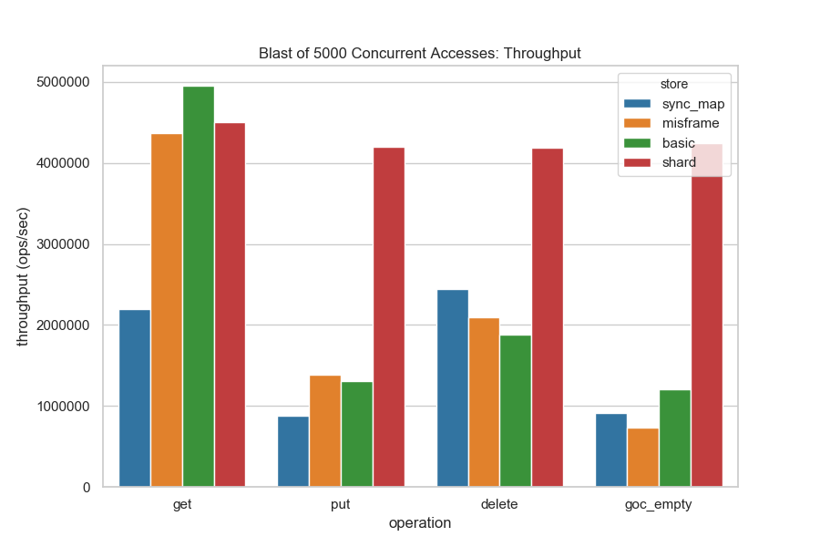
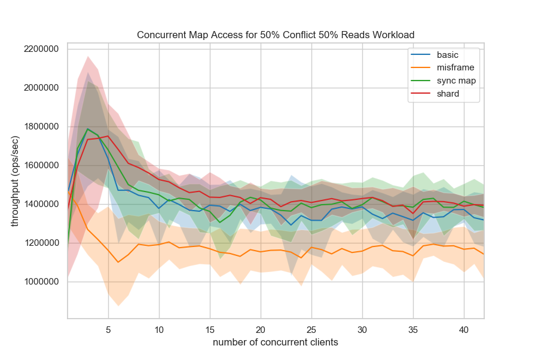
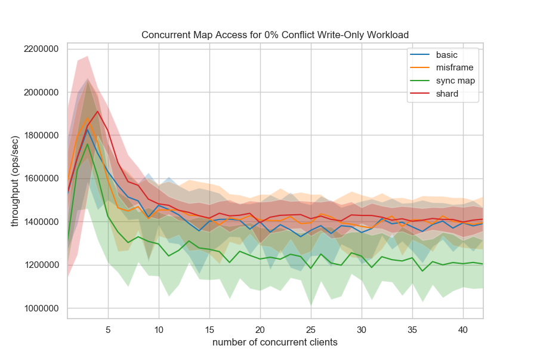
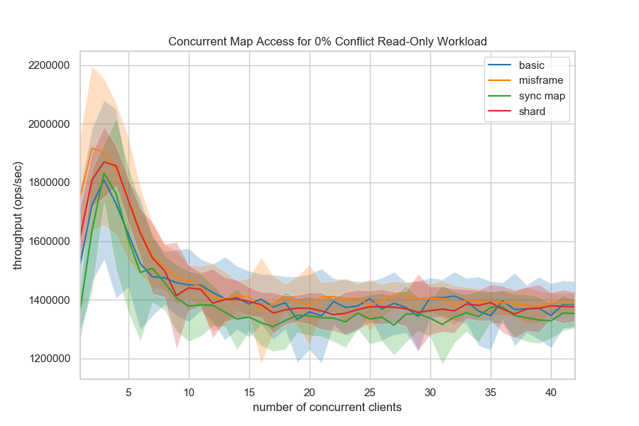
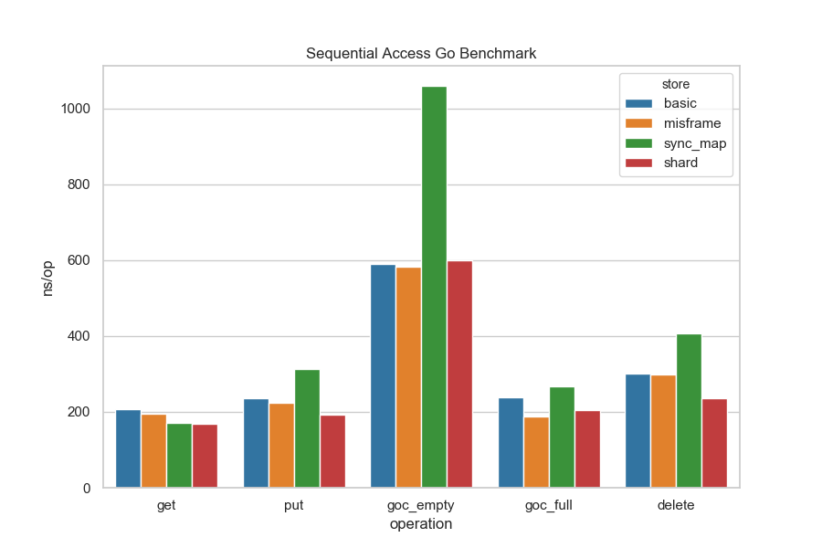

# Speed Maps

**Benchmarks for concurrent access to key/value data structures.**

[](https://travis-ci.com/bbengfort/speedmap)

Here's the scenario: multiple clients are reading and writing values to different keys in a shared data structure. Each client is in their own go routine, unfortunately this means that a lock or a channel is required to synchronize accesses to the store. In this repository we explore different synchronization methods for concurrent access to the store to find out what is the most performant for various workloads.

There are two parts to each benchmark:

1. A data structure that implements the `Store` interface.
2. A workload that defines access patterns for increasing threads.

The store interface is pretty straight forward:

```go
type Store interface {
    Init() (err error)
    Get(key string) (value []byte, err error)
    Put(key string, value []byte) (err error)
    Delete(key string) (err error)
    GetOrCreate(key string, value []byte) (actual []byte, created bool)
}
```

The following stores have been implemented:

1. Basic: wraps a `map[string][]byte` with a `sync.RWMutex` (baseline) and treats `GetOrCreate` as a write operation.
2. Misframe: optimizes `GetOrCreate` as described in [Optimizing Concurrent Map Access in Go](https://misfra.me/optimizing-concurrent-map-access-in-go/).
3. [`sync.Map`](https://golang.org/pkg/sync/#Map): the official concurrent map object in the sync package.
4. Shard: map sharded into 32 different maps and accessed via hash, similar to the implementation of [concurrent-map](https://github.com/orcaman/concurrent-map). 









### Operation Benchmarks

Here are the operational benchmarks for various store operations:



Note that the `Get` benchmark allocates keys from 0-255, then Gets the key in the benchmark by `i%256`; the timer is reset after storing the keys. Put just puts the key determined by `i` to the benchmark, which may exist already, since it seems that `i` is not necessarily unique across iterations (I can't explain it either). The `GetOrCreateEmpty` benchmark does not pre-allocate the database, but `GetOrCreateFull` does. The expectation is that the default key has to be inserted in the former case, but not in the latter. Finally the `Delete` benchmark does both a `Put` and a `Delete`, both have to be measured together, there is no way to isolate the `Delete` at the moment.

Here are the raw benchmark numbers:

```
goos: darwin
goarch: amd64
pkg: github.com/bbengfort/speedmap/store
BenchmarkGet/basic-8                     	 5000000	       207 ns/op
BenchmarkGet/misframe-8                  	10000000	       194 ns/op
BenchmarkGet/sync_map-8                  	10000000	       172 ns/op
BenchmarkGet/shard-8                     	10000000	       168 ns/op

BenchmarkPut/basic-8                     	10000000	       236 ns/op
BenchmarkPut/misframe-8                  	10000000	       225 ns/op
BenchmarkPut/sync_map-8                  	 5000000	       312 ns/op
BenchmarkPut/shard-8                     	10000000	       192 ns/op

BenchmarkGetOrCreateEmpty/basic-8         	 2000000	       590 ns/op
BenchmarkGetOrCreateEmpty/misframe-8      	 2000000	       582 ns/op
BenchmarkGetOrCreateEmpty/sync_map-8      	 1000000	      1059 ns/op
BenchmarkGetOrCreateEmpty/shard-8         	 2000000	       600 ns/op

BenchmarkGetOrCreateFull/basic-8          	10000000	       238 ns/op
BenchmarkGetOrCreateFull/misframe-8       	10000000	       187 ns/op
BenchmarkGetOrCreateFull/sync_map-8       	 5000000	       267 ns/op
BenchmarkGetOrCreateFull/shard-8          	10000000	       204 ns/op

BenchmarkDelete/basic-8                   	 5000000	       302 ns/op
BenchmarkDelete/misframe-8                	 5000000	       298 ns/op
BenchmarkDelete/sync_map-8                	 3000000	       407 ns/op
BenchmarkDelete/shard-8                   	 5000000	       237 ns/op
```
